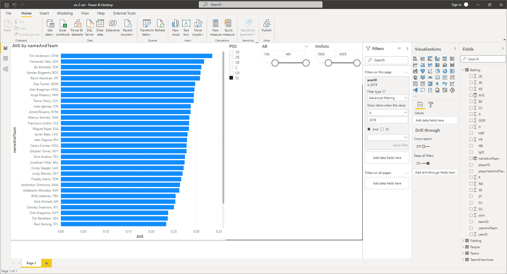
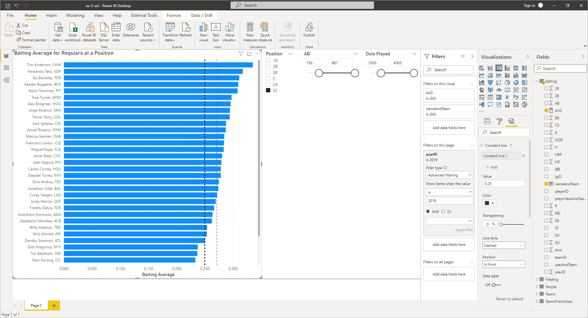

# Virtual Machine (VM) Exercises

## 1st VM Exercise

#### Dataset

- [x] Add datasets used to the `datasets/` folder

#### Files

- [x] **Initial**: Add file to the `exercises/`  folder with the name `ex-1-intial.twbx` or `ex-1-intial.pbix`, depending if you are auditioning for a Tableau or Power BI course.
- [x] **Solution**: Add file to the `exercises/`  folder with the name `ex-1-sol.twbx` or `ex-1-sol.pbix`

#### Learning Objective

*One measurable learning objective that this exercise assesses*

Use bar and column charts to compare numeric measures across categories

#### Motivation

*3 - 4 sentence description of why it’s important to learn how to do this task (linking back to the learning objective). Explain how this would be used in a real-life situation. Why is it useful, what problem does it solve?*

As a general manager of a baseball team, we want to be able to understand our team's relative strengths and weaknesses compared to other teams.  One method of doing so is to compare regular players at a position versus one another using a consistent measure.  Here, we will compare our starting shortstop versus other shortstops in Major League Baseball for the year 2019.  We will use a bar chart to show how our starting shortstop performs in one measure of play--hitting the ball--versus other players at the same position.

#### Steps to be executed by the student (max 6)

*Each bulleted instruction is a complete sentence that describes a specific task.*

- On the Filters menu, drag `yearID` from the `Batting` table into the **Filters on this page** section. Show items when the value **is** 2019 and select **Apply filter**.
- Add a new clustered bar chart visual to the report.  Use `nameAndTeam` as the Axis and `AVG` (batting average) as the Values.  Stretch out the graph to the bottom of the available screen space and wide enough to include full names without cutting off any characters.
- Add a slicer visual to the report.  Its Field should be `POS` (position) from the `Fielding` table.  On the slicer, select **SS** (for shortstop).
- Add a new slicer visual to the report.  Its Field should be `AB` (at-bats) from the `Batting` table.  Set the range of this slicer from 150 to the maximum of 681.  In a normal season, 150 at-bats is a good proxy for a player who has spent a considerable amount of the season on a team.
- Add a new slicer visual to the report.  Its Field should be `InnOuts` (number of outs recorded on defense) from the `Fielding` table.  Set the range of this slicer from 1000 to its maximum of 4305.  Use this to answer the question, "What is the name of the shortstop with the highest batting average in 2019?"  Answer with the full value of name and team as displayed in the visual.

#### End goal:

*Add an image of the final visualization here.*

## 2nd VM Exercise

#### Dataset

- [x] Add datasets used to the `datasets/` folder

#### Files

- [x] **Initial**: Add file to the `exercises/`  folder with the name `ex-2-intial.twbx` or `ex-2-intial.pbix`, depending if you are auditioning for a Tableau or Power BI course.
- [x] **Solution**: Add file to the `exercises/`  folder with the name `ex-2-sol.twbx` or `ex-2-sol.pbix`

#### Learning Objective

*One measurable learning objective that this exercise assesses*

Format and configure visuals

#### Motivation

*3 - 4 sentence description of why it’s important to learn how to do this task (linking back to the learning objective). Explain how this would be used in a real-life situation. Why is it useful, what problem does it solve?*

Although our current report does display the data we want, we can make it easier to extract the appropriate emotional cue by formatting the visual in various ways.  By adding appropriate titles and clear labels, we can make it easier for our general manager to understand the report at a glance.  We can also add constant values to serve as independent benchmarks.

#### Steps to be executed by the student (max 6)

*Each bulleted instruction is a complete sentence that describes a specific task.*

- Select the `AVG` measure in the `Batting` table.  Navigate to **Measure tools** and set the number of spots after the decimal to 3.  Batting average is historically represented as a value like .275, with 3 spots after the decimal.
- Select the `AVG by nameAndTeam` bar chart visual.  Select the **Format** menu item for the visual and navigate to Y axis section.  Scroll down to **Title** in the Y axis menu and turn it off.  Navigate to the X axis section and change the **Start** to 0 instead of its default.  Notice how much difference this small change makes in how you interpret the graph!  Then, change **Value decimal places** to 3.  Then change the Axis title to read "Batting Average" and move on to the Title section.  Change the title to "Batting Average for Regulars at a Position"
- Select the `POS` slicer.  Navigate to the **Format** menu and choose the **Slicer header** section.  Change the Title text to "Position" and leave the rest alone.
- Select the `InnOuts` slicer.  Navigate to the **Format** menu and choose the **Slicer header** section.  Change the title to "Outs Played" and leave the rest alone.
- Return to the bar chart and select the **Analytics** menu.  Navigate to **Average line** and add a new line.  Set the color to **White, 60% darker**.  This line a mid-point of sorts, giving us an indication if a shortstop is better or worse than the norm.
- Next, add a Constant line with a value of 0.250.  .250 is a rule of thumb number for an adequate player.  Set the color of the constant line to **Black, 20% lighter** and **Transparency** to 0%.  Use this information to answer the question, "What is the name of the shortstop closest to the .250 line?"  Answer with the full value of name and team as displayed in the visual.

#### End goal:

*Add an image of the final visualization here.*

